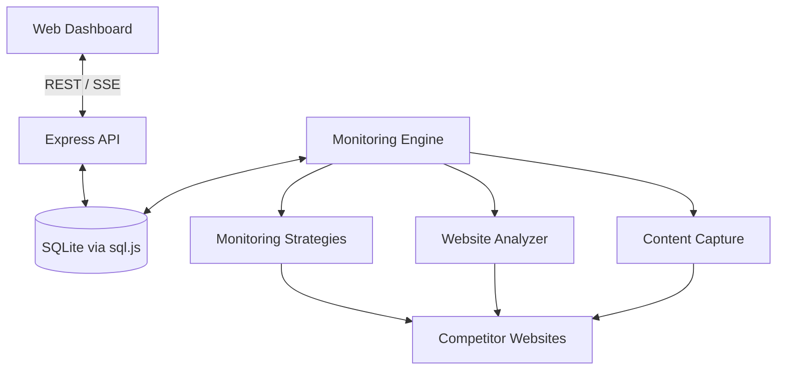
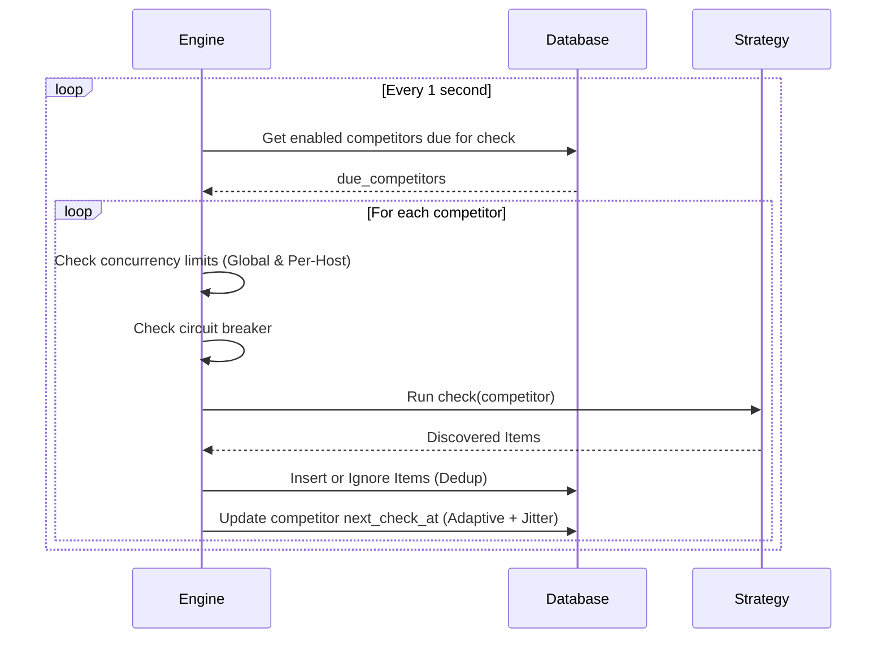
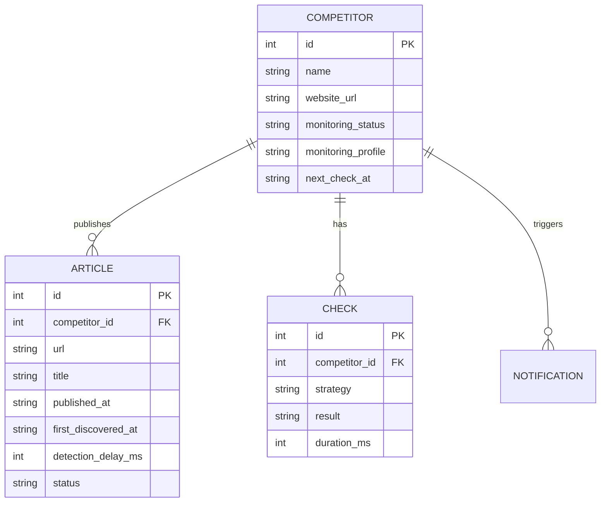

# System Architecture

## Component Diagram

```mermaid
graph TD
  UI[Web Dashboard] <-->|REST / SSE| API[Express API]
  API <--> DB[(SQLite via sql.js)]
  
  Worker[Monitoring Engine] <--> DB
  Worker --> Analyzer[Website Analyzer]
  Worker --> Strategies[Monitoring Strategies]
  Worker --> Capture[Content Capture]
  
  Strategies --> Target[Competitor Websites]
  Analyzer --> Target
  Capture --> Target
```

## Scheduler Flow

```mermaid
sequenceDiagram
  participant E as Engine
  participant DB as Database
  participant S as Strategy
  
  loop Every 1 second
    E->>DB: Get enabled competitors due for check
    DB-->>E: due_competitors
    
    loop For each competitor
      E->>E: Check concurrency limits (Global & Per-Host)
      E->>E: Check circuit breaker
      E->>S: Run check(competitor)
      S-->>E: Discovered Items
      E->>DB: Insert or Ignore Items (Dedup)
      E->>DB: Update competitor next_check_at (Adaptive + Jitter)
    end
  end
```

## Data Model

```mermaid
erDiagram
    COMPETITOR ||--o{ ARTICLE : publishes
    COMPETITOR ||--o{ CHECK : has
    COMPETITOR ||--o{ NOTIFICATION : triggers
    
    COMPETITOR {
        int id PK
        string name
        string website_url
        string monitoring_status
        string monitoring_profile
        string next_check_at
    }
    
    ARTICLE {
        int id PK
        int competitor_id FK
        string url
        string title
        string published_at
        string first_discovered_at
        int detection_delay_ms
        string status
    }
    
    CHECK {
        int id PK
        int competitor_id FK
        string strategy
        string result
        int duration_ms
    }
```
